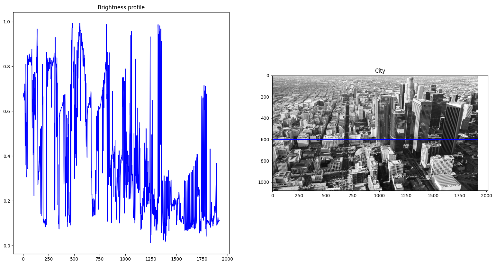
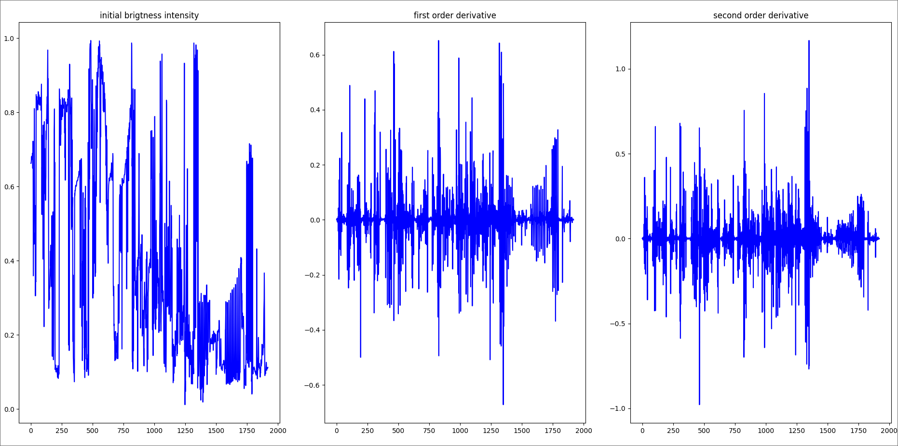
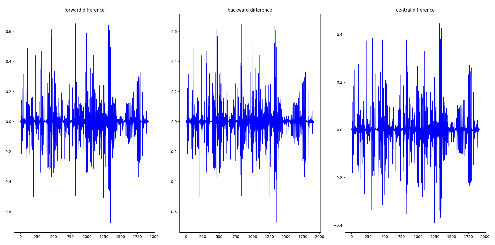

### Problem 2.1
#### 1. Define edge and provide examples to illustrate the concept.

Edges are characterized by a rapid variation in the intensity of the pixels. Fig.1 represents the brightness profile along a horizontal blue line in image, which clearly shows a sudden decrease in the brightness of the pixels.




with following implementation

```python
import skimage.io as io
import skimage.color as color
import matplotlib
matplotlib.use("TkAgg")
import matplotlib.pyplot as plt

def convert_to_rgb_format(img):
    if img.shape[2] == 4:
        img = color.rgba2rgb(img)
    return img


def convert_to_gray_scale(img):
    return color.rgb2gray(img)

img = io.imread("./sky.png")

img = convert_to_rgb_format(img)

g = convert_to_gray_scale(img)

cut = 600
profil = g[cut, :]

plt.figure(figsize=(10, 5)) 

plt.subplot(1, 2, 1)  
plt.plot(profil, "b")  
plt.title("Brightness profile")  

plt.subplot(1, 2, 2) 
plt.imshow(g, cmap="gray")  
plt.plot((0, g.shape[1]), (cut, cut), "b")  
plt.title("City")  

plt.show()


```


#### 2. Explain how derivatives are utilized for edge detection

##### with visual examples

an edge can be detected by analyzing the first derivative of the intensity profile, taken perpendicular to the edge. Similarly, an edge can be detected by determining the zero crossing of the second derivative.

###### since image depends on two dimensions, we use partial derivatives
$$\frac{\partial f(x,y)}{\partial x} \ \ \ and \ \ \ \frac{\partial f(x,y)}{\partial y} $$
and gradient with finite differences
$$ \nabla f(x,y) = \begin{pmatrix} f(x+1,y) - f(x,y) \\ f(x,y+1) - f(x,y) \end{pmatrix} $$
and second order derivative, Laplacian
$$ \Delta f = \nabla \cdot \nabla f = \begin{pmatrix} f(x+1,y) - 2f(x,y) + f(x-1,y) \\ f(x,y+1) - 2f(x,y) + f(x,y-1) \end{pmatrix}$$
this is the illustration of application of first and second order derivatives with forward difference

and implementation
```python
import numpy as np
import skimage.io as io
import skimage.color as color
import matplotlib

matplotlib.use("TkAgg")
import matplotlib.pyplot as plt


def convert_to_rgb_format(img):
    if img.shape[2] == 4:
        img = color.rgba2rgb(img)
    return img


def convert_to_gray_scale(img):
    return color.rgb2gray(img)


def grad_f(y):
    grd = [0 for _ in range(y.shape[0])]
    for i in range(y.shape[0] - 1):
        grd[i] = y[i + 1] - y[i]
    return np.array(grd)


img = io.imread("./sky.png")

img = convert_to_rgb_format(img)

g = convert_to_gray_scale(img)

cut = 600
profil = g[cut, :]

y = np.array(profil)

grd = grad_f(y)

grd_2 = grad_f(grd)

fig, axs = plt.subplots(1, 3, figsize=(15, 5))


axs[0].plot(y, color="blue")
axs[0].set_title("initial brigtness intensity")


axs[1].plot(grd, color="blue")
axs[1].set_title("first order derivative")


axs[2].plot(grd_2, color="blue")
axs[2].set_title("second order derivative")

plt.tight_layout()
plt.show()

```

#### investigate impact of truncation error in finite differences formula
to investigate impact of truncation errors we can calculate gradient and Laplacian for multiple finite differences formulas compare results by visualizing and calculate relative errors

###### forward difference

$$ \lim_{h \to 0} \frac{f(x+h) - f(x)}{h}$$
###### backward difference
$$ \lim_{h \to 0} \frac{f(x) - f(x-h)}{h}$$
###### central difference
$$ \lim_{h \to 0} \frac{f(x+h) - f(x-h)}{2h} $$
from the image below we can see that central difference yields more accurate rate of change in intensity of pixels from initial picture. 

with relative errors
```
Relative error between forward and backward 6.167518521609531
Relative error between forward and central 3.0837592608047655
Relative error between backward and central 3.0837592608047655
```

and implementation
```python
import numpy as np
import skimage.io as io
import skimage.color as color
import matplotlib
matplotlib.use("TkAgg")
import matplotlib.pyplot as plt

def convert_to_rgb_format(img):
    if img.shape[2] == 4:
        img = color.rgba2rgb(img)
    return img


def convert_to_gray_scale(img):
    return color.rgb2gray(img)


def forward_f(y):
    grd = [0 for _ in range(y.shape[0])]
    for i in range(y.shape[0] - 1):
        grd[i] = y[i + 1] - y[i]
    return np.array(grd)


def backward_f(y):
    grd = [0 for _ in range(y.shape[0])]
    for i in range(1, y.shape[0]):
        grd[i] = y[i] - y[i - 1]
    return np.array(grd)


def central_f(y):
    grd = [0 for _ in range(y.shape[0])]
    for i in range(1, y.shape[0] - 1):
        grd[i] = (y[i + 1] - y[i - 1]) / 2
    return np.array(grd)


def relative_error(x, y):
    return np.linalg.norm(x - y)

img = io.imread("./sky.png")

img = convert_to_rgb_format(img)

g = convert_to_gray_scale(img)

cut = 600
profil = g[cut, :]

y = np.array(profil)

f_y = forward_f(y)
b_y = backward_f(y)
c_y = central_f(y)

print(f"Relative error between forward and backward {relative_error(f_y,b_y)}")
print(f"Relative error between forward and central {relative_error(f_y,c_y)}")
print(f"Relative error between backward and central {relative_error(b_y,c_y)}")

fig, axs = plt.subplots(1, 3, figsize=(15, 5))

axs[0].plot(f_y, color="blue")
axs[0].set_title("forward difference")


axs[1].plot(b_y, color="blue")
axs[1].set_title("backward difference")


axs[2].plot(c_y, color="blue")
axs[2].set_title("central difference")

plt.tight_layout()
plt.show()
```

### Problem 2.2
#### Investigate higher order derivatives for edge detection

to investigate higher order derivatives we can use  **Prewitt** operators and compute convolution. 
for first order derivative it has following form
$$ f(x+1,y) - f(x,y) = \sum_m \sum_n h_x(m,n)f(x-m,y-n)$$
with kernel
$$h_x(0,0) = -1 , \ h_x(-1,0) = +1, \ h_x(m,n) = 0 \ elsewhere$$
and similar idea is applied to higher order derivatives with kernels


$$ h_x = \begin{pmatrix} +1 & 0 & -1 \\ +1 & 0 & -1 \\ +1 & 0 & -1 \end{pmatrix} \ \ \ h_y = \begin{pmatrix} +1 & +1 & +1 \\ 0 & 0 & 0 \\ -1 & -1 & -1 \end{pmatrix}$$
- first calculate vertical and horizontal prewitt operators by convolution
 $$ h_x \ \circledast f \ \ and \ \ h_y \circledast f $$
 and then calculate magnitude M with is "fusion" of both operators to get the final result
 $$ M = \sqrt{(h_x \ \circledast f)^2 + (h_y \circledast f)^2} $$
 and to get even more clear image we can use Thresholding to get following result
 
![[./pics/edging.png]]
#### Potential of higher order derivatives for extracting other features

we can even get additional information by calculating angle of the edge.
by calculating following expression 
$$ A = \tan^{-1} \left( \frac{h_y \circledast f}{h_x \circledast f} \right)$$
the color of the edges corresponds to the angle. For example, an angle of 0 is re[]()d, and an angle of $\frac{\pi}{2}$ is blue.

![[./pics/angle.png]]

and following implementation
```python
import numpy as np
import skimage.io as io
import skimage.color as color
import matplotlib
from scipy.signal import convolve

matplotlib.use("TkAgg")

import matplotlib.pyplot as plt


def convert_to_rgb_format(img):
    if img.shape[2] == 4:
        img = color.rgba2rgb(img)
    return img


def convert_to_gray_scale(img):
    return color.rgb2gray(img)


def threshold(g, T):
    h, w = g.shape[:2]
    for j in range(h):
        for i in range(w):
            if g[j, i] >= T:
                g[j, i] = 1
            else:
                g[j, i] = 0
    return g


def prewitt_operator(g):
    h_x = np.array([[1, 0, -1], [1, 0, -1], [1, 0, -1]])
    h_y = np.array([[1, 1, 1], [0, 0, 0], [-1, -1, -1]])

    grad_x = convolve(g, h_x, mode="same")
    grad_y = convolve(g, h_y, mode="same")

    M = np.sqrt(grad_x**2 + grad_y**2)  # NOTE: magnitude M

    A = np.arctan(grad_y / grad_x)  # NOTE: angle A

    return M, A


img = io.imread("./sky.png")

img = convert_to_rgb_format(img)

g = convert_to_gray_scale(img)

M, A = prewitt_operator(g)

plt.figure(figsize=(10, 5))

plt.subplot(1, 2, 1)
plt.imshow(img)
plt.title("Original Image")

plt.subplot(1, 2, 2)
plt.imshow(threshold(M, 0.5), cmap="gray")
plt.title("Prewitt Operator with magnitude M")
plt.show()
```

### Problem 2.3

#### Provide two illustrations of how derivatives are applied in real-world scenarios.

#### Present a visual representation for at least one of the examples
