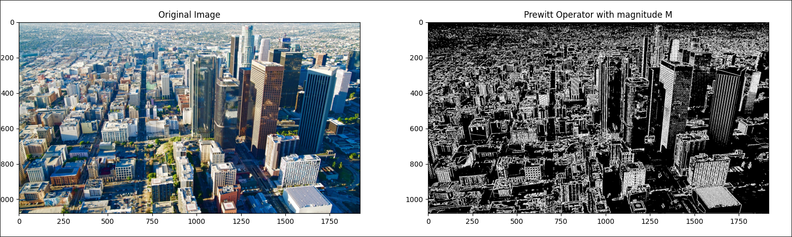
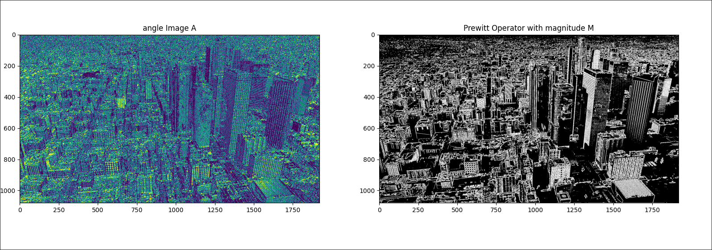

#### Investigate higher order derivatives for edge detection

to investigate higher order derivatives we can use  **Prewitt** operators and compute convolution. 
for first order derivative it has following form

$$ f(x+1,y) - f(x,y) = \sum_m \sum_n h_x(m,n)f(x-m,y-n)$$

with kernel

$$h_x(0,0) = -1 , \ h_x(-1,0) = +1, \ h_x(m,n) = 0 \ elsewhere$$

and similar idea is applied to higher order derivatives with kernels


$$ h_x = \begin{pmatrix} +1 & 0 & -1 \\ +1 & 0 & -1 \\ +1 & 0 & -1 \end{pmatrix} \ \ \ h_y = \begin{pmatrix} +1 & +1 & +1 \\ 0 & 0 & 0 \\ -1 & -1 & -1 \end{pmatrix}$$

- first calculate vertical and horizontal prewitt operators by convolution

 $$ h_x \ \circledast f \ \ and \ \ h_y \circledast f $$
 
 and then calculate magnitude M with is "fusion" of both operators to get the final result
 
 $$ M = \sqrt{(h_x \ \circledast f)^2 + (h_y \circledast f)^2} $$
 
 and to get even more clear image we can use Thresholding to get following result
 

#### Potential of higher order derivatives for extracting other features

we can even get additional information by calculating angle of the edge.
by calculating following expression 

$$ A = \tan^{-1} \left( \frac{h_y \circledast f}{h_x \circledast f} \right)$$

the color of the edges corresponds to the angle. For example, an angle of 0 is re[]()d, and an angle of $\frac{\pi}{2}$ is blue.



and following implementation
```python
import numpy as np
import skimage.io as io
import skimage.color as color
import matplotlib
from scipy.signal import convolve

matplotlib.use("TkAgg")

import matplotlib.pyplot as plt


def convert_to_rgb_format(img):
    if img.shape[2] == 4:
        img = color.rgba2rgb(img)
    return img


def convert_to_gray_scale(img):
    return color.rgb2gray(img)


def threshold(g, T):
    h, w = g.shape[:2]
    for j in range(h):
        for i in range(w):
            if g[j, i] >= T:
                g[j, i] = 1
            else:
                g[j, i] = 0
    return g


def prewitt_operator(g):
    h_x = np.array([[1, 0, -1], [1, 0, -1], [1, 0, -1]])
    h_y = np.array([[1, 1, 1], [0, 0, 0], [-1, -1, -1]])

    grad_x = convolve(g, h_x, mode="same")
    grad_y = convolve(g, h_y, mode="same")

    M = np.sqrt(grad_x**2 + grad_y**2)  # NOTE: magnitude M

    A = np.arctan(grad_y / grad_x)  # NOTE: angle A

    return M, A


img = io.imread("./sky.png")

img = convert_to_rgb_format(img)

g = convert_to_gray_scale(img)

M, A = prewitt_operator(g)

plt.figure(figsize=(10, 5))

plt.subplot(1, 2, 1)
plt.imshow(img)
plt.title("Original Image")

plt.subplot(1, 2, 2)
plt.imshow(threshold(M, 0.5), cmap="gray")
plt.title("Prewitt Operator with magnitude M")
plt.show()
```
